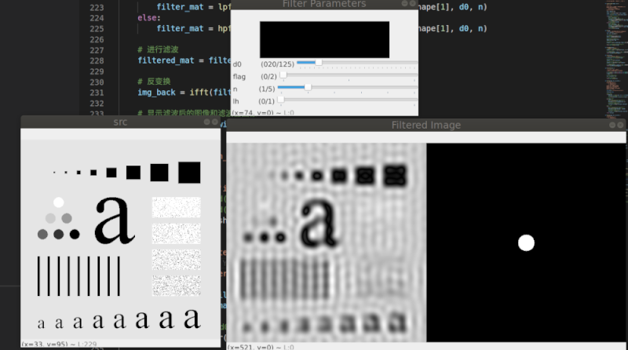
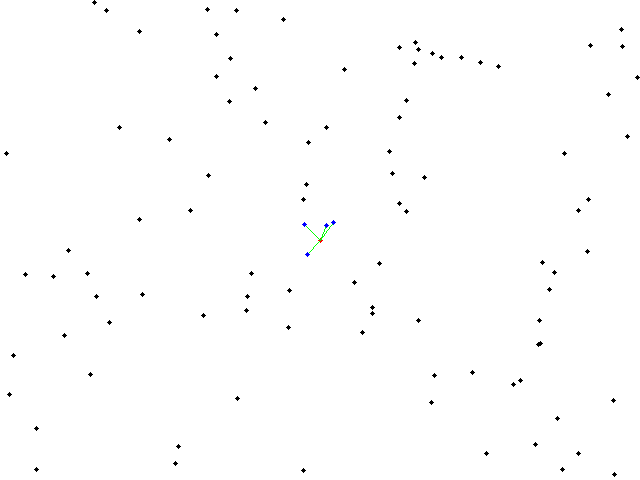
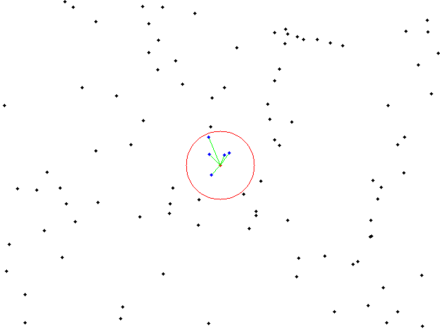

# code_module

## opencv

1. fft-频域处理(python)
   理想滤波、巴特沃兹滤波和高斯滤波的高通、低通滤波演示



## eigen

1. LevenbergMarquardt-linear regression-拟合直线示例

```
target line is y = 2*x + 5
optimizing...1 1
optimizing...1 1
optimizing...1 1
optimizing...1 1
optimizing...2.00042 5.03425
optimizing...2.00042 5.03425
optimizing...2.00042 5.03425
optimizing...2.00042 5.03425
optimizing...2.00042 5.03425
status: 3
x that minimizes the function: 
2.00042
5.03425
```

## 数据结构

1. 四叉树空间划分和碰撞检测


2. opencv flann库的使用示例 opencv/flann/01_knn.cc

**knn_result**



**radius_result**


