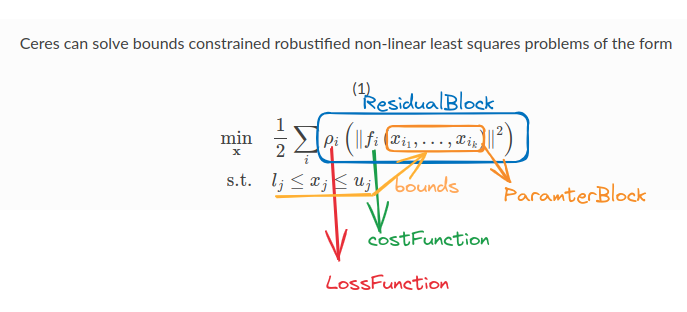
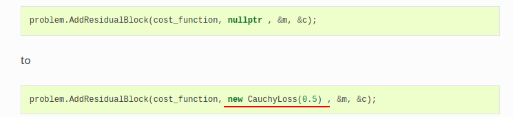

To deal with outliers, a standard technique is to use a [LossFunction](http://www.ceres-solver.org/nnls_modeling.html#_CPPv4N5ceres12LossFunctionE "ceres::LossFunction").

A **LossFunction** is a scalar function that is used to reduce the influence of outliers on the solution of non-linear least squares problems.

linear_solver_type：信赖域方法中求解线性方程组所使用的求解器类型，默认为DENSE_QR，其他可选项如下：

DENSE_QR（QR分解，用于小规模最小二乘问题求解）、

DENSE_NORMAL_CHOLESKY&SPARSE_NORMAL_CHOLESKY（Cholesky分解，用于具有稀疏性的大规模非线性最小二乘问题求解）、

CGNR（使用共轭梯度法求解稀疏方程）

DENSE_SCHUR&SPARSE_SCHUR（SCHUR分解，用于BA问题求解）、

ITERATIVE_SCHUR（使用共轭梯度SCHUR求解BA问题）

### 求导方法使用

For the impatient amongst you, here is some high level advice:

1. Use [Automatic Derivatives](http://www.ceres-solver.org/automatic_derivatives.html#chapter-automatic-derivatives).
2. In some cases it maybe worth using [Analytic Derivatives](http://www.ceres-solver.org/analytical_derivatives.html#chapter-analytical-derivatives).
3. Avoid [Numeric derivatives](http://www.ceres-solver.org/numerical_derivatives.html#chapter-numerical-derivatives). Use it as a measure of last resort, mostly to interface with external libraries.

## 参考

原文链接：https://blog.csdn.net/qq_38410730/article/details/131439027
